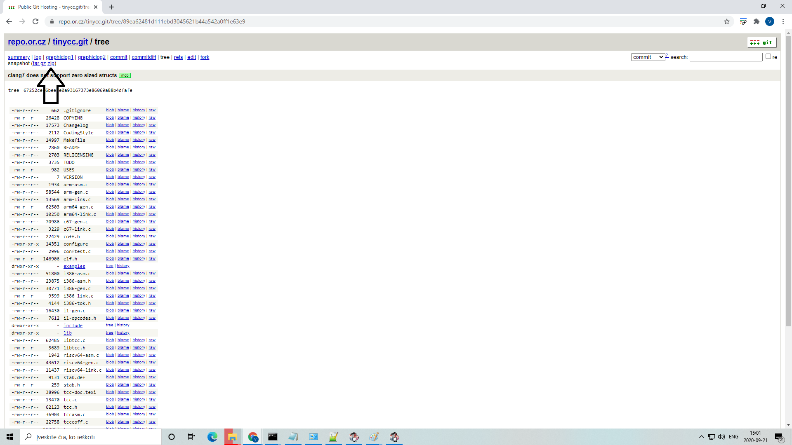

## Compiling Tiny C Compiler on Windows Operating system (A personal research)
Tiny C Compiler can be compiled using MinGW, cl or TCC itself. 

To compile With MinGW:

Download MinGW Setup: **mingw-get-setup.exe**  
https://osdn.net/projects/mingw/releases/

use **mingw-get-setup.exe** to download **MinGW Installation Manager**

Use **MinGW Installation Manager** to download/install **mingw32-base-bin** package.

After the **mingw32-base-bin** package download - Add **C:\MinGW\bin** to system environment Path

Then Download Tiny C Compiler latest Source code from the git repository
https://repo.or.cz/tinycc.git/tree/89ea62481d111ebd3045621b44a542a0ff1e63e9

After extracting the Tiny C Compiler Source Code.

Simply double click on the file  **tinycc-HEAD-8f9bf3f\win32\build-tcc.bat**

GCC will start to compile the TCC source code.  
And soon you should see **tcc.exe**  appear in the folder this way: **tinycc-HEAD-8f9bf3f\win32\tcc.exe**

## Compiling using TCC itself

